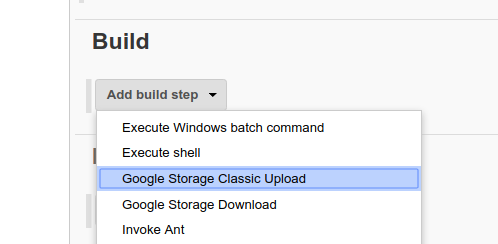
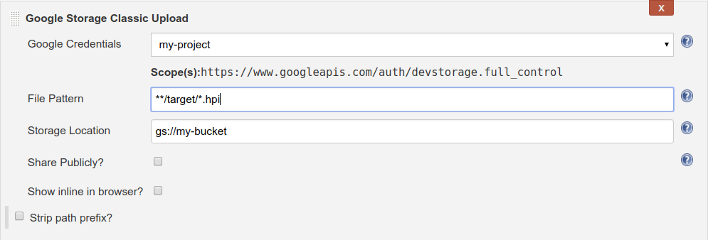
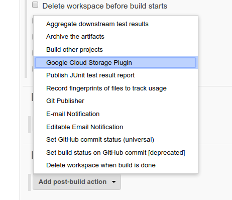

# Google Cloud Storage Plugin Documentation

This plugin provides functionality to communicate with [Google Cloud Storage](https://cloud.google.com/storage), as build steps, post-build steps, or pipeline steps.

## Credentials

All steps consume credentials surfaced by the [Google OAuth Credentials Plugin](https://github.com/jenkinsci/google-oauth-plugin) for authenticating storage requests.  Once you have register a credential (e.g. “my-project”) that provides storage access you will see:

If no suitable credentials are found, you will see:

In this case, you will need to set up credentials in the Credentials tab (see instructions for [Google OAuth Credentials Plugin](https://github.com/jenkinsci/google-oauth-plugin).

## Build Step

Two build steps are supported by this plugin:

    * Classic Upload step to upload files to Google Storage, and
    * Download step to get files from Google Storage into the local Jenkins workspace.
	

## Classic Upload Build Step

Use the Classic Upload Build Step to upload an ant-style glob of files (File Pattern) to the specified storage path **(Storage Location)**. Select:

    * **Share Publicly** to make the uploaded files publicly accessible,
    * **Show inline in browser** to set the metadata of the files such that the file is shown inline in browser, rather than downloaded,
    * **Strip path prefix** and specify the prefix you want to strip if you don’t want the whole path of the local files reflected in the bucket object name.
	
## Download Build Step

Use the Download step to download files **(Object to download)** from Cloud Storage into the local directory. The wildcards here act the same way as in GSUtil tool. Currently only a single asterisk at the lowest level of the object name is supported.

If you don't want the whole path of the object to be reflected in the directory structure, select **Strip path prefix** to strip a prefix from the object names.

## Pipeline Step

Both Classic Upload and Download functionality are available through pipelines and can be generated with Pipeline Syntax builder.

## Post-build step

This plugin provides the “Google Cloud Storage Uploader” post-build step for publishing build artifacts to Google Cloud Storage. Download functionality is not supported, but can be accessed as a Build Step (see above).

Configure the post-build step with any combination of the following sub-steps:

### Bucket with expiring elements lifecycle

Use this step to set a time to live for a given Google Cloud Storage bucket. It will configure the named bucket to delete objects after the specified number of days.

### Build log upload

This step uploads the contents of the Jenkins build log to the specified storage path.

To configure this operation to upload stdout even if the build fails, check "For failed jobs". To configure the operation to make the uploaded logs publicly accessible, check "Share publicly".

### Classic upload

Classic Upload has the same functionality as the Build Step Classic Upload step. One additional option is "**For failed jobs**". Check this box to do the upload to Google Cloud Storage even if the build fails.

